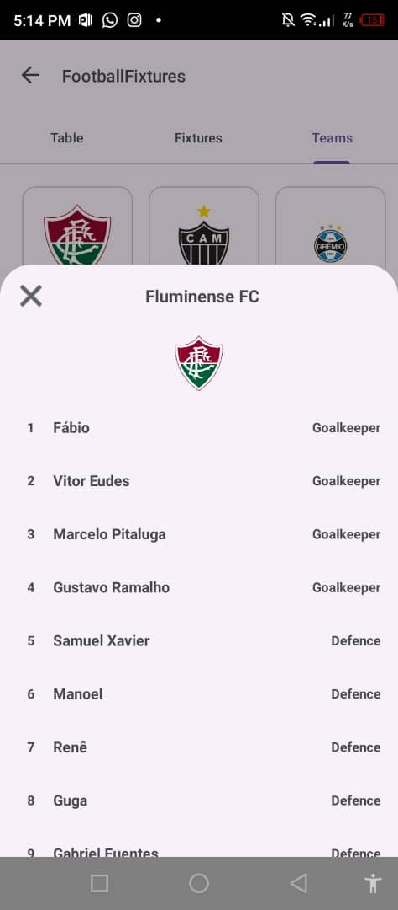

# Football Fixtures
A modern Android application for browsing football fixtures, team details, and league standings, built with a scalable architecture

## Screenshots

Click here

<table>
<tr>
<th></th>
<th></th>
<th></th>
</tr>

<tr>
<th>Today's Fixtures</th>
<th>Competitions</th>
<th>Table</th>
</tr>

<tr>
<th></th>
<th></th>
<th></th>
</tr> 

<tr>
<th>Fixtures</th>
<th>Teams</th>
<th>Teams Details</th>
</tr>

</table>

## Technologies & Architecture
- Kotlin: Primary programming language, leveraging coroutines and modern features.
- MVVM Architecture: Separation of concerns using ViewModels, Repositories, and UI components.
- ### Jetpack Components:
  - ViewModel & StateFlow for reactive state management
  - Navigation Component for fragment transitions and deep linking
  - Room for local persisting of fixtures and entities
  - ViewBinding for type-safe XML interaction
  - ConstraintLayout: All UIs use flexible modern Android layouts
- Dependency Injection:
  - Hilt Dagger-Hilt for easy, robust DI across the app
- Networking:
  - Retrofit to access the football-data REST API
  - Gson for serialization/deserialization of JSON data
  - OkHttp Logging Interceptor for easier network debugging
- Image Loading:
  - Glide for fast, memory-efficient image loading team emblems, badges, etc
